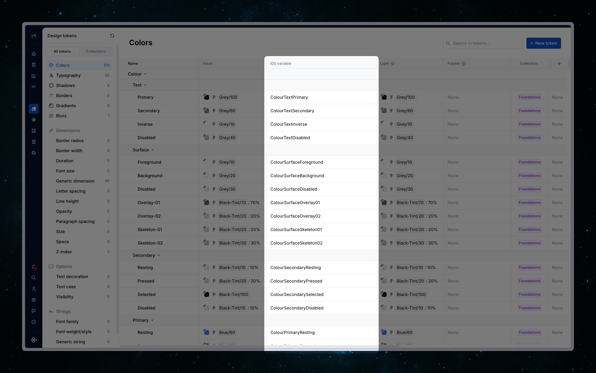

# Xcode Color Set Exporter (PoC)

Exports Supernova color tokens to Apple Xcode Asset Catalog color sets (`.xcassets`).
Each color token produces one `<name>.colorset/Contents.json` file with a compact array format.

## What it does
- Generates an Xcode asset catalog structure for color tokens
- For each color token, writes a `Contents.json` containing:
  - Base (universal) entry
  - Optional dark appearance entry derived from selected themes
- Ensures unique, stable folder names using token hierarchy and a configurable naming style
- Optional write-back of generated folder names to tokens as a custom property

## Installation (in Supernova.io)
1) Commit/push this exporter folder to a Git host (or use the path within this monorepo).
2) Copy the URL to the exporter folder in the repository (the folder that contains `exporter.json`).
3) In Supernova: Workspace → Code automation → Exporters → New custom exporter.
4) Paste the URL and confirm. Supernova will register the exporter.
5) The exporter is now available in your workspace and can be used in pipelines.

Notes:
- If the repository is private, ensure the Supernova integration/credentials can access it.
- If you don't use Github for hosting the exporter, change also the Git provider.
- The exporter expects `dist/build.js` to exist; build locally and commit if needed.

## Theme behavior
- No themes selected: only base entry
- One theme selected: base = original tokens, dark = that theme
- Two or more themes selected: base = FIRST theme, dark = SECOND theme (others ignored)

## Output structure
When `generateRootCatalog = true` (default):
```
<root>
  Colors.xcassets/                  # or custom rootCatalogPath
    Contents.json
    <token-name>.colorset/
      Contents.json                 # array with base + dark entries
```

When `generateRootCatalog = false`:
```
<root>
  <token-name>.colorset/
    Contents.json
```

## File format
Each token file (`<name>.colorset/Contents.json`) is an array like:
```json
[
  {
    "idiom": "universal",
    "color": {
      "color-space": "srgb",
      "components": {
        "red": "0x86",
        "green": "0x15",
        "blue": "0x17",
        "alpha": "0.180"
      }
    }
  },
  {
    "appearances": [{ "appearance": "luminosity", "value": "dark" }],
    "idiom": "universal",
    "color": { ...themed components... }
  }
]
```

## Configuration
Defined in `config.json` (Pulsar exporter schema). Key options:
- `generateRootCatalog` (boolean, default true): create root `.xcassets` folder with `Contents.json`.
- `rootCatalogPath` (string, default `Colors.xcassets`): root path (supports nested folders using `/`).
- `folderNameStyle` (enum, default `pascalCase`): naming style for `.colorset` folders.
- `writeNameToProperty` (boolean, default false): enable write-back of folder names to tokens.
- `propertyToWriteNameTo` (string, default "iOS variable"): custom property key for write-back.

These are available in the Supernova exporter UI and can be overridden in pipelines.

## Write-back (keeps docs and Portal in sync)
When `writeNameToProperty` is enabled, the exporter saves the generated folder name for each color token
into a custom property (default: "iOS variable"). This makes the value visible in Supernova token management section and available in documentation/Portal as custom properties — always reflecting the latest exported naming used in code.



How it works:
- During export (non-preview), the exporter computes the final folder name using the configured `folderNameStyle`.
- It writes that value back to the token as a custom propertiy via `WriteTokenPropStore`, under `propertyToWriteNameTo`.
- These values are great to surface in docs or the Portal so designers/devs see the exact, current identifier used by code.

## Local dependencies
- `@supernovaio/export-utils` — local monorepo dependency (linked via `file:../../utils`)

Ensure the monorepo root is installed so `utils` is present, then run `npm i` in this exporter before building.

## Development
- Install dependencies (from this exporter folder):
```
npm i
```
- Build once:
```
npm run build
```
- Watch during development:
```
npm run dev
```

Build produces `dist/build.js` which is referenced by `exporter.json` as the executable.

## Iteration tips
- Source code:
  - `src/index.ts` — exporter entry; token/theme resolution, pathing, write-back
  - `src/files/color-sets.ts` — file builders (root catalog, per-token files)
- If you change config schema, update both `config.json` (UI schema) and `config.ts` (types)
- This is a PoC — it intentionally omits advanced features like multiple platform idioms, appearance matrices, or color spaces beyond sRGB.

## License
MIT
